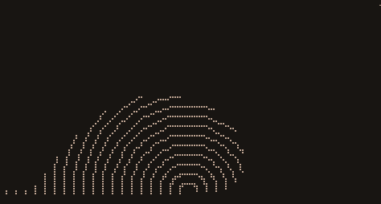

# drawille-canvas



HTML5 Canvas API for [`drawille`](https://github.com/madbence/node-drawille).

## Install

```
$ npm install drawille-canvas
```

## Usage

See [example](example.js), check out in the console (`node example`) or in the [browser](http://madbence.github.io/node-drawille-canvas/) (`example.html`).

## API

### new Canvas(width, height)

Creates a new `Canvas` with the given dimensions.
For method details, see [`CanvasRenderingContext2D` on MDN](https://developer.mozilla.org/en-US/docs/Web/API/CanvasRenderingContext2D)

### c.fillRect(x, y, w, h)

Fills the given area of the canvas.

### c.clearRect(x, y, w, h)

Clears the given area of the canvas.

### c.save()

Save the current transformation matrix on the stack.

### c.restore()

Restore the last transformation matrix.

### c.translate(x, y)

Translate the current transformation matrix.

### c.rotate(a)

Rotate the current transformation matrix with the given angles.

### c.scale(x, y)

Scale the current transformation matrix.

### c.beginPath()

Start a new path.

### c.closePath()

Close the current path.

### c.moveTo(x, y)

Moves the starting point of the next segment to the given coordinates.

### c.lineTo(x, y)

Connects the starting point with the given point with a straight line.

### c.stroke()

Stroke the current path.

## TODO

- add `.fill` to fill paths
- add `.arc`, `.arcTo`

## License

MIT
